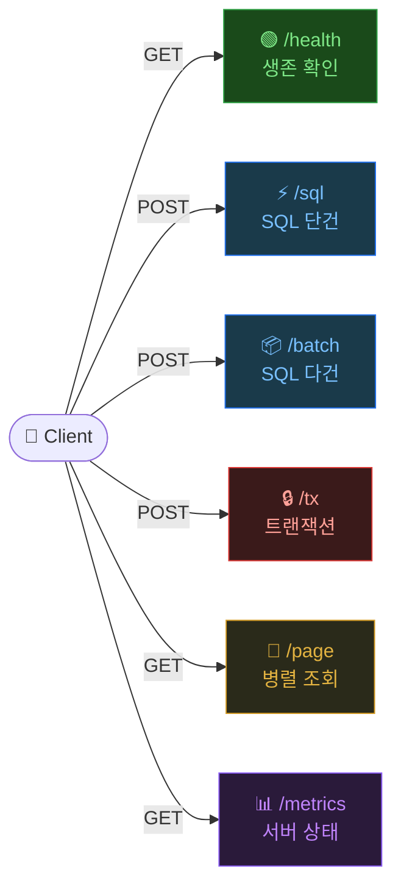
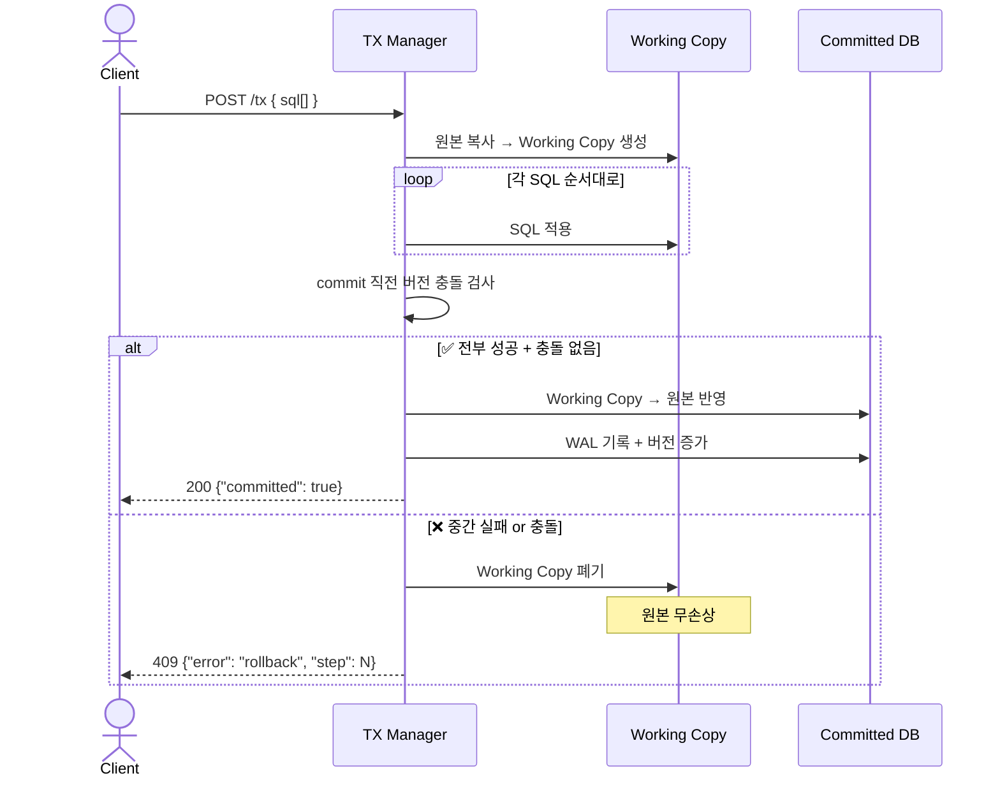

# 🗄️ Mini DBMS API Server

기존 SQL 처리기를 REST API 서버로 확장한 프로젝트입니다.  

---

## 특징

| 항목 | 내용 |
|------|------|
| **REST API** | `/sql` `/batch` `/tx` `/page` `/metrics` |
| **이중 스레드풀** | API Worker Pool + DB Query Pool 분리 |
| **트랜잭션** | 원자성 보장, 중간 실패 시 자동 롤백 |
| **동시성 제어** | MVCC(읽기) + Row-level Lock(쓰기) |
| **영속성** | WAL 기반 강제 종료 후 복구 |

---

## API 엔드포인트

```
GET  /api/v1/health    서버 생존 확인
POST /api/v1/sql       SQL 단건 실행
POST /api/v1/batch     SQL 다건 일괄 실행
POST /api/v1/tx        트랜잭션 묶음 실행
GET  /api/v1/page      병렬 조회 + trace 반환
GET  /api/v1/metrics   서버 상태 조회
```



---

## 동시성 정책

| 계층 | 담당 | 보장하는 것 |
|------|------|------------|
| **MVCC** | 읽기 | 읽는 중 값이 섞여 보이는 현상 차단 |
| **Row-level Lock** | 쓰기 | 같은 `table+id` 동시 쓰기 충돌 방지 |

```mermaid
flowchart TB
    subgraph READ["📖 읽기 경로 — MVCC"]
        direction LR
        R1["읽기 요청"] --> R2["Snapshot 생성\n(시작 시점 버전)"]
        R2 --> R3["버전 기준 조회\n타 트랜잭션 영향 없음"]
        R3 --> R4["✅ 일관된 결과"]
    end

    subgraph WRITE["✏️ 쓰기 경로 — Row-level Lock"]
        direction LR
        W1["쓰기 요청\ntable + id"] --> W2{"Lock\n획득 가능?"}
        W2 -->|Yes| W3["쓰기 실행"]
        W2 -->|No| W4["대기\n(선행 완료까지)"]
        W4 --> W3
        W3 --> W5["✅ 직렬화 완료"]
    end

    style READ fill:#0d1117,stroke:#2ea043
    style WRITE fill:#0d1117,stroke:#d29922
```



---

## 트랜잭션

> 여러 SQL을 **한 묶음**으로 실행 — 하나라도 실패하면 **전체 취소**

**이 프로젝트에서 보장하는 것**

- **Atomicity** — 전부 성공 또는 전부 롤백
- **읽기 일관성** — 트랜잭션 시작 시점 snapshot 기준
- **충돌 감지** — commit 직전 버전 충돌 검사



---

## 이중 스레드 풀

> "요청 처리"와 "DB 작업"을 분리해 **지연 전파를 차단**

```mermaid
flowchart LR
    Req(["🌐 HTTP 요청"])

    subgraph API["API Worker Pool"]
        AQ[/"📥 API Queue"/]
        AW1["Worker 1"]
        AW2["Worker 2"]
        AW3["Worker N"]
    end

    subgraph DB["DB Query Pool"]
        DQ[/"📥 DB Queue"/]
        DW1["Worker 1"]
        DW2["Worker 2"]
        DW3["Worker N"]
    end

    ENG[("🗄️ DB Engine")]
    Res(["📤 응답"])

    Req --> AQ
    AQ --> AW1 & AW2 & AW3
    AW1 & AW2 & AW3 --> DQ
    DQ --> DW1 & DW2 & DW3
    DW1 & DW2 & DW3 --> ENG
    ENG --> Res

    style API fill:#0d1117,stroke:#1f6feb
    style DB  fill:#0d1117,stroke:#8b5cf6
```



**분리 효과**

```
단일 풀:  [무거운 쿼리가 스레드 독점] → 가벼운 요청도 대기 
이중 풀:  [DB 풀에서 무거운 쿼리 격리] → API 풀은 항상 응답 가능
```

`/page` 병렬 조회는 DB 풀의 여러 Worker에서 동시에 실행되어 응답 시간을 단축합니다.

---

## 빠른 실행

```bash
make build
./bin/dbsrv
```

```bash
# 헬스체크
curl http://localhost:8080/api/v1/health

# SQL 실행
curl -X POST http://localhost:8080/api/v1/sql \
  -H "Content-Type: application/json" \
  -d '{"sql": "SELECT * FROM users"}'

# 트랜잭션
curl -X POST http://localhost:8080/api/v1/tx \
  -H "Content-Type: application/json" \
  -d '{"sqls": ["INSERT INTO users VALUES (1,\"alice\")", "UPDATE users SET name=\"bob\" WHERE id=1"]}'
```
Docker 실행:

```bash
docker build -t sqlprocessor:local .
docker run --rm -p 8080:8080 sqlprocessor:local ./bin/dbsrv
```

## API 목록

- `GET /api/v1/health`
- `POST /api/v1/sql`
- `POST /api/v1/batch`
- `POST /api/v1/tx`
- `GET /api/v1/page`
- `GET /api/v1/metrics`

## 프로젝트 특징

- C 기반 SQL 엔진을 REST API 서버로 확장
- API Worker Pool + DB Query Pool 이중 풀 구조
- `/api/v1/page` 병렬 조회 시 trace로 동작 확인 가능
- 트랜잭션 롤백/캐시/부하 시연까지 한 화면 데모 제공
- CSV + B+Tree 기반 엔진을 유지하면서 동시성 처리 강화

## 동시성 정책 (MVCC + Row-level Lock)

### 1) MVCC + Optimistic Commit

- 읽기: snapshot 기준으로 일관성 보장
- 쓰기: private working copy에서 처리 후 commit 시 충돌 검사

### 3) Row-level Write Lock (table + id shard)

- `/api/v1/sql` 단건 쓰기 경로에서 `table + id` 기준 락 샤딩
- 같은 row(id) 쓰기는 직렬화
- 다른 id는 병렬 처리

### 둘을 함께 쓸 때 막는 상황

- MVCC가 막는 것:
  - 읽는 도중 다른 트랜잭션이 커밋해도 “중간 상태가 섞여 보이는 문제”
  - 트랜잭션 단위의 읽기 일관성 붕괴
- Row-level lock이 막는 것:
  - 같은 `table+id`를 동시에 갱신할 때 발생하는 write-write 충돌
  - 동일 row 동시 쓰기에서의 실패 급증

정리하면, **MVCC는 읽기 일관성**, **row-level lock은 동일 row 동시 쓰기 충돌**을 담당합니다.

즉, 읽기 전용이 아니라 **읽기/쓰기 혼합** 상황을 시연합니다.

---

## 테스트

```bash
make test
```

---

## 📊 메트릭 예시

```json
{
  "threads": {
    "api_pool":  { "active": 3, "idle": 5, "queue_depth": 0 },
    "db_pool":   { "active": 2, "idle": 6, "queue_depth": 1 }
  },
  "requests": {
    "total": 15420,
    "success": 15380,
    "error": 40,
    "avg_ms": 2.3
  },
  "mvcc": {
    "active_snapshots": 2,
    "committed_versions": 8821
  }
}
```
