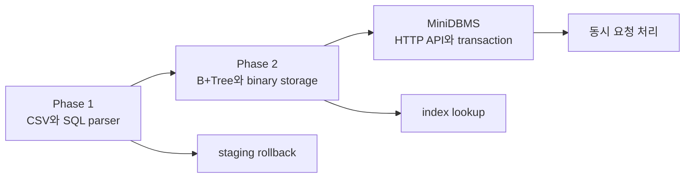
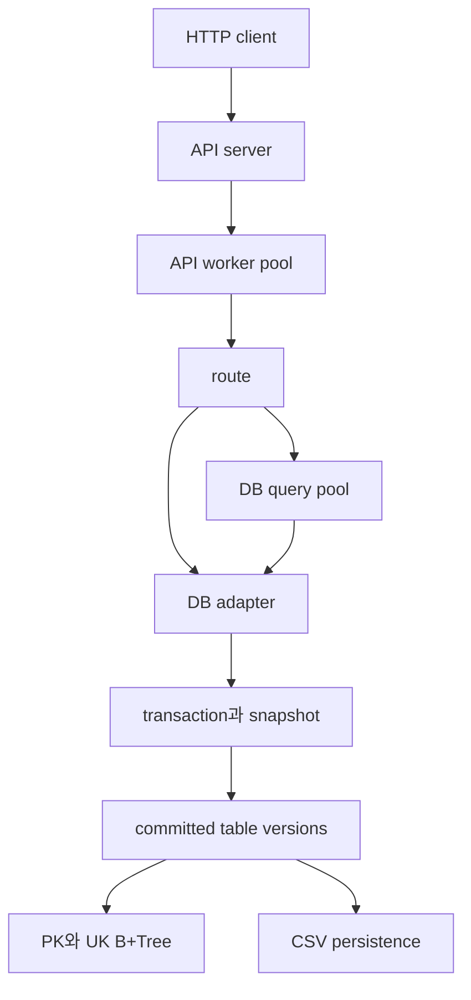

# MiniDBMS

C로 만든 SQL engine을 여러 client가 동시에 사용할 수 있는 HTTP API server로 확장했습니다. B+Tree index, 두 개의 thread pool, snapshot transaction, CSV persistence를 하나의 실행 흐름으로 연결한 팀 프로젝트입니다.

## 시작한 이유

단일 process에서 query를 실행하는 것과 여러 HTTP 요청이 동시에 들어오는 server를 운영하는 것은 다른 문제였습니다. 요청 처리 thread가 막히지 않으면서 같은 데이터를 일관되게 읽고, 실패한 transaction이 원본을 바꾸지 않는 구조를 공부하려고 만들었습니다.

## 발전 과정


```mermaid
flowchart LR
    P1[Phase 1\nCSV와 SQL parser] --> P2[Phase 2\nB+Tree와 binary storage]
    P2 --> P3[MiniDBMS\nHTTP API와 transaction]
    P1 --> ROLLBACK[staging rollback]
    P2 --> INDEX[index lookup]
    P3 --> CONCURRENCY[동시 요청 처리]
```

## 핵심 기능

| 영역 | 구현 |
| --- | --- |
| HTTP | POSIX socket 기반 API와 JSON response |
| 동시성 | API worker pool과 DB query pool 분리 |
| Transaction | private working copy와 commit conflict 검사 |
| 읽기 | 시작 시점에 보이는 committed table version 선택 |
| Index | PK와 UK의 B+Tree 단건, 범위 조회 |
| 저장 | CSV temporary file 작성 후 rename |
| 관찰 | health, metrics, 병렬 query trace |

## 아키텍처와 코드 구조


```mermaid
flowchart TD
    CLIENT[HTTP client] --> SERVER[API server]
    SERVER --> API_POOL[API worker pool]
    API_POOL --> ROUTE[route]
    ROUTE --> DB_POOL[DB query pool]
    ROUTE --> DBAPI[DB adapter]
    DB_POOL --> DBAPI
    DBAPI --> TX[transaction과 snapshot]
    TX --> VERSION[committed table versions]
    VERSION --> INDEX[PK와 UK B+Tree]
    VERSION --> CSV[CSV persistence]
```

| 경로 | 역할 |
| --- | --- |
| `src/api/` | request parsing, route, response와 metrics |
| `src/thr/pool.c` | 고정 worker와 bounded queue |
| `src/db/dbapi.c` | query 실행과 transaction API |
| `src/db/mvcc.c` | snapshot id와 active transaction 관리 |
| `src/legacy/bptree.c` | index 단건과 범위 조회 |
| `tests/` | pool, transaction, API와 benchmark 회귀 검사 |

## 문제 해결 과정

### API 요청과 DB 작업의 worker 분리

API worker가 무거운 DB query를 같은 pool에 넣고 결과를 기다리면, 모든 worker가 대기 상태가 되어 queue를 처리할 thread가 사라질 수 있습니다. HTTP 처리용 pool과 DB query용 pool을 분리해 서로의 작업을 기다리며 고갈되지 않게 했습니다.

`/api/v1/page`는 같은 snapshot을 공유하는 네 query를 DB pool에 나누어 실행합니다. response에는 각 작업의 thread id와 latency trace를 담아 실제 병렬 실행 순서를 확인할 수 있습니다.

### 원본 대신 private working copy에서 수정

transaction 도중 원본 table을 직접 바꾸면 다음 query가 실패했을 때 앞선 변경을 되돌려야 합니다. 첫 write에서 table version을 복제하고 transaction의 모든 query를 private copy에 적용했습니다.

commit 직전에 시작할 때 보았던 base와 현재 head가 같은지 확인합니다. 다른 transaction이 먼저 반영됐다면 충돌로 종료하고 working copy를 버립니다. 현재 충돌 단위는 row가 아니라 table입니다.

### benchmark dataset 경로를 한 번만 해석

benchmark generator는 `data/legacy` 경로를 실행기에 전달했지만 실행기 역시 같은 directory로 먼저 이동했습니다. 결과적으로 경로가 두 번 붙어 dataset 생성이 실패했습니다.

generator는 실행기 기준의 file name만 전달하고, 회귀 test는 임시 directory에서 실제 두 binary를 실행해 CSV와 workload file이 모두 만들어지는지 확인합니다. 이 test를 `make bench-test`에 연결했습니다.

### commit 결과를 temporary CSV로 교체

CSV를 바로 덮어쓰면 write 중단 시 일부 row만 남을 수 있습니다. 새 table 전체를 `.tmp` file에 기록하고 성공한 뒤 원본과 교체했습니다. memory의 committed version은 immutable하게 유지해 진행 중인 snapshot read가 같은 내용을 계속 보게 했습니다.

## 기여

API server와 transaction core는 팀원이 중심이 되어 구현했습니다. 저는 사용자가 동작을 확인하고 반복 검증할 수 있는 흐름을 맡았습니다.

- browser 기반 live demo와 병렬 query 시각화
- HTTP API 성공과 실패 시나리오 보강
- thread pool test 안정화
- k6 load script와 metrics 출력 연결
- benchmark dataset 경로 수정과 실제 binary 회귀 test
- 발표 흐름과 아키텍처 문서 정리

## 실행 방법

Linux 또는 WSL에서 실행합니다.

```bash
make build
./bin/dbsrv
```

```bash
curl http://localhost:8080/api/v1/health
curl -X POST http://localhost:8080/api/v1/sql \
  -H "Content-Type: application/json" \
  -d '{"query":"SELECT * FROM users"}'
```

Docker를 사용할 수도 있습니다.

```bash
docker build -t mini-dbms .
docker run --rm -p 8080:8080 mini-dbms ./bin/dbsrv
```

## 테스트

```bash
make clean
make test
make bench-test
make bench-smoke
```

`make test`는 pool, snapshot, DB API, transaction과 HTTP route를 검사합니다. `make bench-test`는 계산식과 dataset 경로를 확인하고, `make bench-smoke`는 고정 seed의 작은 workload를 세 번 실행합니다.

자세한 내용은 [`docs/ARCH.md`](./docs/ARCH.md), [`docs/API.md`](./docs/API.md), [`docs/DECISIONS.md`](./docs/DECISIONS.md), [`docs/TEST.md`](./docs/TEST.md)에서 확인할 수 있습니다.

## 남은 과제

- table 단위 충돌을 row 또는 page 단위로 세분화
- WAL append, fsync 순서와 startup recovery 구현
- HTTP keep-alive와 connection timeout 정책 추가

## 관련 프로젝트

- [MiniDBMSPhase1](https://github.com/NearthYou/MiniDBMSPhase1): CSV parser와 staging rollback
- [MiniDBMSPhase2](https://github.com/NearthYou/MiniDBMSPhase2): B+Tree와 binary storage
