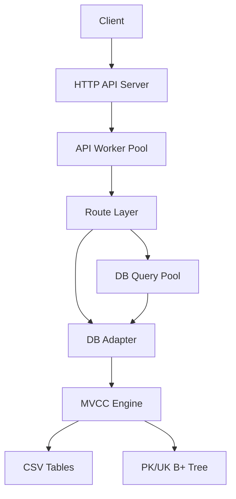

# 아키텍처

## 전체 구조

## 레이어 설명

### 1. API Layer

- 위치: `src/api`
- 역할:
  - HTTP request parse
  - route dispatch
  - JSON response 생성
  - queue full / bad method / bad route 처리

핵심 파일:

- `src/api/srv.c`
- `src/api/route.c`
- `src/api/resp.c`

### 2. Thread Pool

- 위치: `src/thr/pool.c`
- 정책:
  - 요청마다 thread 생성하지 않음
  - queue + fixed worker
  - shutdown 시 graceful drain

두 개의 풀이 분리됩니다.

- API Pool: HTTP 요청 처리
- DB Pool: 병렬 조회 SQL 처리

### 3. DB Adapter

- 위치: `src/db/dbapi.c`
- 역할:
  - SQL parse
  - snapshot 획득
  - tx begin/commit/abort
  - CRUD 결과를 구조화된 `DbRes` 로 변환

공개 인터페이스:

- `db_open`
- `db_close`
- `db_exec`
- `db_batch`
- `db_begin`
- `db_txdo`
- `db_commit`
- `db_abort`
- `db_snap`
- `db_done`

### 4. MVCC

현재 구현은 row-level MVCC가 아니라 table-snapshot copy-on-write MVCC 입니다.

구성 개념:

- `Db`: table registry 와 MVCC 전역 상태 보유
- `DbSnap`: read snapshot id
- `DbTx`: transaction context
- `TabVer`: table의 immutable committed version

동작:

1. read는 snapshot id 를 잡고 visible version만 조회
2. write는 first write 시 base version clone
3. commit 시 head/base 충돌 검사
4. 성공 시 새 version install
5. 실패 시 working copy 폐기

### 5. 인덱스

기존 `src/legacy/bptree.c` 를 재사용합니다.

- PK exact / range
- UK exact / range

SELECT는 조건을 보고 인덱스 경로를 먼저 시도하고, 맞지 않으면 선형 탐색으로 내려갑니다.

### 6. 데이터 저장

- legacy CLI: CSV + `.delta` + `.idx`
- API engine: CSV persisted table + in-memory version chain

API engine commit 시에는 CSV를 새 상태로 flush하고, 기존 `.delta`, `.idx` side file은 제거합니다.

## `/page` 병렬 처리

`/api/v1/page` 는 같은 snapshot을 공유한 4개의 SELECT를 DB Pool에 나눠 넣습니다.

- 화면 일관성 유지
- thread id / latency trace 수집
- 발표용 데모 포인트 확보
