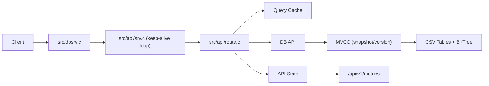
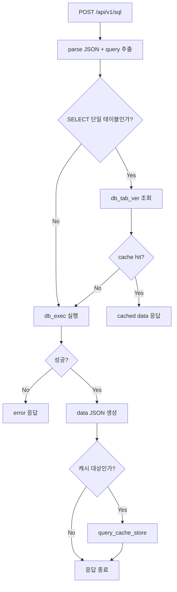
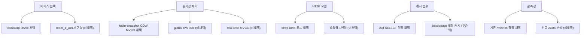

# 학습 가이드 (구조 분석용)
 
팀이 함께 코드 구조를 빠르게 이해하는 **학습 세션 진행표**입니다.

## 0) 세션 목표

- 이 변경이 "어디에 붙었는지"를 설명할 수 있다.
- 요청 1개가 서버 안에서 어떻게 흐르는지 말할 수 있다.
- cache / stats / keep-alive / worker default의 연결점을 그림으로 정리할 수 있다.

세션 끝에 아래 3개를 남기면 성공입니다.
- 아키텍처 한 줄 요약
- 요청 흐름 다이어그램(텍스트로도 가능)
- 아직 이해 안 된 지점 3개

## 1) 읽는 순서 (같이 화면 보면서)

### 1. 서버 진입점

- `src/dbsrv.c`
- 확인 질문:
  - 환경변수는 어디서 읽는가?
  - worker 기본값은 언제 자동 계산되는가?
  - 서버 시작/실패 경로는 어떻게 갈리는가?

### 2. 연결 처리와 HTTP 루프

- `src/api/srv.c`
- 확인 질문:
  - keep-alive는 어떤 루프로 구현되었는가?
  - 요청 파싱 버퍼는 어떻게 재사용되는가?
  - parse/send/에러 경로에서 공통적으로 하는 정리는 무엇인가?

### 3. 라우팅과 기능 결합점

- `src/api/route.c`
- 확인 질문:
  - `/api/v1/sql`에서 cache가 붙는 정확한 위치는 어디인가?
  - cache hit/miss와 stats 집계는 어디서 증가하는가?
  - `/api/v1/metrics` 응답은 기존 필드 + 신규 필드를 어떻게 합치는가?

### 4. DB 버전 정보와 캐시 일관성

- `src/db/dbapi.h`
- `src/db/dbapi.c`
- `src/api/cache/query_cache.c`
- 확인 질문:
  - table version은 어디서 읽고, 왜 필요한가?
  - TTL과 table version이 함께 쓰이는 이유는 무엇인가?
  - 이 조합이 stale 응답을 줄이는 원리는 무엇인가?

### 5. 관측 지표와 테스트

- `src/api/stats/stats.c`
- `tests/api_test.sh`
- 확인 질문:
  - timing_ns 각 항목(parse/lock_wait/engine/json/send)은 어디서 측정되는가?
  - 테스트가 keep-alive와 cache 동작을 어떤 순서로 검증하는가?
  - 환경 제약 때문에 실패할 수 있는 구간은 어디인가?

## 2) 토론할 때 쓰는 핵심 질문 5개

- 이 구조에서 "요청 처리의 중심 파일"은 하나인가, 여러 개인가?
- 기능 추가가 기존 계층을 깨지 않고 붙었는가?
- 코드 흐름을 처음 보는 사람이 헷갈릴 지점은 어디인가?
- metrics 숫자를 보고 실제 병목을 추정할 수 있는가?
- 다음 학습 주제로 자연스럽게 이어질 지점은 어디인가?

## 3) 세션 산출물 템플릿

아래 3줄만 채워도 학습 기록으로 충분합니다.

- 구조 요약: `dbsrv -> srv -> route -> dbapi -> mvcc/cache/stats`
- 우리가 이해한 핵심: `예: /sql SELECT에서 cache hit면 db_exec 전에 반환`
- 다음에 볼 것: `예: db_batch와 /page의 snapshot 공유 방식`

## 4) 진행 중 주의사항

- "맞다/틀리다" 판정보다 "왜 이렇게 설계했는지"를 먼저 본다.
- 파일 전체 낭독 대신, 함수 단위로 목적을 요약한다.
- 모르면 바로 기록하고 넘어간다. (세션 흐름 끊지 않기)

핵심 질문은 하나로 유지합니다:  
**"이 코드가 어떤 책임을 어디서 나눠서 처리하는가?"**

## 5) 기술 선택 정리 (우리 프로젝트 기준)

아래는 이번 구조에서 실제로 채택한 기술과, 그에 따른 트레이드오프입니다.

### 5-1) 주요 분기점 요약

| 분기점 | 선택한 기술 | 왜 이걸 택했는가 | 포기한 대안 |
|---|---|---|---|
| 베이스 브랜치 | `codex/api-mvcc` | MVCC/tx/batch/page가 이미 있어 확장 비용이 작음 | `team_1`, `team_1_wei`를 베이스로 재구성 |
| 동시성 제어 | table-snapshot COW MVCC | 현재 CSV 엔진 구조에 가장 자연스럽게 붙음 | 전역 RW lock, row-level MVCC |
| HTTP 처리 모델 | keep-alive 연결 루프 | 연결 재사용으로 처리량 개선 + 학습 포인트 큼 | 요청당 1연결 모델 |
| 캐시 적용 범위 | `/api/v1/sql` 단일 SELECT만 | 효과 대비 리스크가 가장 낮음 | `/batch`, `/page`까지 확장 캐시 |
| 관측성 설계 | `/metrics` 확장(`http/cache/timing_ns`) | 기존 계약 유지 + 병목 분석 가능 | 신규 `/stats` 엔드포인트 분리 |
| 워커 기본값 | `cpu_count * 2` | 환경별 수동 설정 없이 합리적 기본값 제공 | 고정값, 런타임 자동 튜닝 |

### A. 동시성 제어: Table-snapshot COW MVCC

- 우리가 선택한 것:
  - table 단위 snapshot + copy-on-write + commit 시 충돌 감지
- 분기점:
  - "빠르게 안정화 가능한 MVCC" vs "정교하지만 복잡한 row-level MVCC"에서 전자를 선택
- 선택 이유:
  - 기존 CSV 기반 엔진에 비교적 작은 수정으로 snapshot 일관성과 rollback을 구현하기 쉬움
  - `/tx`, `/batch`, `/page` 같은 데모 시나리오와 설명이 명확함
- 장점:
  - 읽기 일관성(snap_id) 확보가 단순함
  - write 충돌 모델이 직관적이라 발표/학습에 유리함
- 단점:
  - write 시 table clone 비용이 커질 수 있음
  - row-level MVCC보다 write-heavy workload에 불리할 수 있음
- 대안:
  - row-level MVCC 체인
  - 글로벌 RW lock
  - 단순 mutex 직렬화

### B. HTTP 처리: keep-alive 기반 연결 루프

- 우리가 선택한 것:
  - 한 TCP 연결에서 여러 요청을 처리하는 keep-alive 루프
- 분기점:
  - "구현 단순성(1요청 1연결)" vs "성능/실사용성(연결 재사용)"에서 후자를 선택
- 선택 이유:
  - 요청당 connect/close 오버헤드를 줄여 API 처리량 개선
  - 학습 관점에서 파서/버퍼/응답 수명주기 이해에 좋은 예제
- 장점:
  - load 상황에서 성능 개선 여지 큼
  - `Connection: close`와 공존 가능
- 단점:
  - 요청 파싱/버퍼 관리가 1회성 모델보다 복잡함
  - 오류 경로 누락 시 누수/무한루프 위험이 커짐
- 대안:
  - 요청당 1연결(close 강제) 모델
  - 이벤트 루프(epoll/kqueue) 기반 비동기 서버

### C. 캐시 전략: SQL 응답 캐시 + TTL + table version

- 우리가 선택한 것:
  - `/api/v1/sql`의 단일 `SELECT` 응답만 캐시
  - 무효화는 `TTL + table version` 이중 조건
- 분기점:
  - "넓은 캐시 범위" vs "안전한 최소 캐시"에서 안전한 최소 캐시를 선택
- 선택 이유:
  - 범위를 좁혀 리스크를 줄이면서 read-heavy 성능 이득 확보
  - MVCC의 table head version을 활용해 일관성 설명이 쉬움
- 장점:
  - hit 시 DB 실행 전에 빠르게 응답 가능
  - stale 응답 가능성을 version 체크로 낮춤
- 단점:
  - SQL 문자열 기반 키라 정규화 수준에 따라 hit율 편차가 큼
  - `/batch`, `/page` 등에는 아직 확장되지 않음
- 대안:
  - 캐시 없음(단순/안전)
  - row/object 캐시
  - route별(page/batch) 응답 캐시

### D. 관측성: API 통계 + 단계별 timing_ns

- 우리가 선택한 것:
  - `/api/v1/metrics`에 기존(`api_pool/db_pool/mvcc`) 유지 + `http/cache/timing_ns` 추가
- 분기점:
  - "기존 계약 유지 확장" vs "새 엔드포인트 분리"에서 호환성 우선 선택
- 선택 이유:
  - 기존 API 계약을 깨지 않으면서 관측 항목 확장 가능
  - 병목 위치(parse/lock_wait/engine/json/send)를 빠르게 추정 가능
- 장점:
  - 성능 이슈를 "느리다"에서 "어디가 느리다"로 바꿔줌
  - 팀 학습/발표 자료로 재사용 가능
- 단점:
  - 계측 코드가 늘어 유지보수 포인트 증가
  - 숫자 해석 기준이 없으면 오해 가능
- 대안:
  - 단순 요청 카운터만 유지
  - 외부 APM/프로파일러 도입

### E. 워커 수 기본값: CPU 기반 동적 계산

- 우리가 선택한 것:
  - `API_THR`, `DB_THR` 미지정 시 `cpu_count * 2` 기본값
- 분기점:
  - "고정 기본값" vs "환경 적응형 기본값"에서 환경 적응형을 선택
- 선택 이유:
  - 환경별 수동 튜닝 없이 "최소 합리적 기본값" 제공
- 장점:
  - 로컬/서버 환경에서 즉시 동작
  - 초반 튜닝 비용 절감
- 단점:
  - workload 특성에 따라 과다/과소 스레드 가능
  - 최적값 보장은 아님
- 대안:
  - 고정값(예: 4)
  - 자동 튜닝(실행 중 조정)

### F. 베이스 아키텍처 선택: `codex/api-mvcc` + `team_1_wei` 포팅

- 우리가 선택한 것:
  - 코어는 `codex/api-mvcc` 유지, 강점은 `team_1_wei`에서 선택 포팅
- 분기점:
  - "기존 고급 기능 유지 + 기능 포팅" vs "경량 브랜치에서 재구축" 중 전자를 선택
- 선택 이유:
  - MVCC/트랜잭션/`/batch`/`/page`가 이미 안정적으로 설계되어 있음
  - `team_1_wei` 강점(cache/stats/keep-alive)을 붙이는 비용이 상대적으로 작음
- 장점:
  - 발표/데모 스토리를 유지하면서 성능/관측성 강화를 동시에 달성
  - 구조 리팩터링 비용을 줄이고 기능 집중 가능
- 단점:
  - 코드 복잡도 증가로 온보딩 난이도 상승
  - 레이어 간 결합점(route-srv-dbapi)이 늘어 유지보수 주의 필요
- 대안:
  - `team_1_wei`를 베이스로 MVCC/tx/page 재구축
  - 공통 최소 코어만 남기고 두 브랜치 기능을 재설계 통합

## 6) 다음 학습 토픽 추천

- `/batch`와 `/page`에서 snapshot 공유 방식 비교
- 캐시 키 정규화(공백/대소문자/리터럴 처리) 설계
- timing_ns 데이터를 이용한 성능 실험 설계

## 7) 함께 보면 좋은 구조도

### 7-1) 전체 요청 처리 흐름

### 7-2) `/api/v1/sql`에서 캐시/실행 분기

### 7-3) 기술 선택 분기 지도

